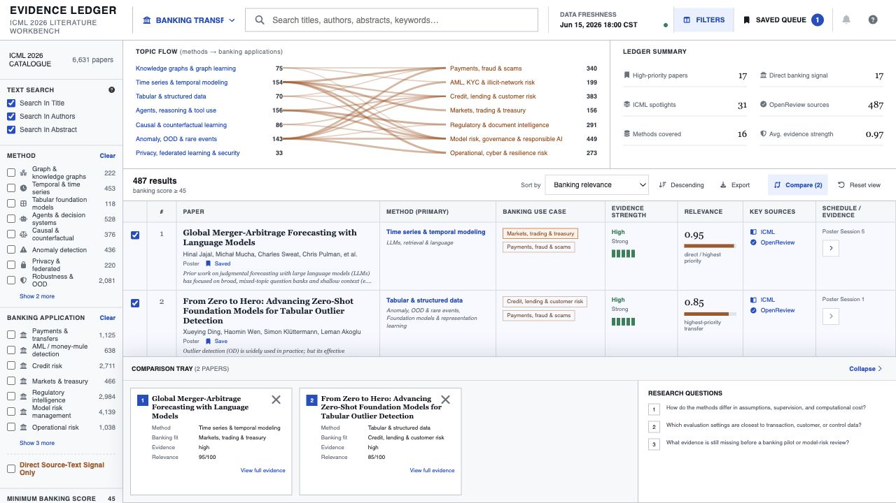

# ICML 2026 Evidence Ledger

An interactive catalogue of 6,631 unique ICML 2026 papers, designed for fast
research triage with deeper emphasis on applied AI and banking.

[Open the public Evidence Ledger](https://aiscorpio.github.io/icml-2026-evidence-ledger/)



## What It Covers

- Knowledge graphs and graph learning
- Time series and temporal modelling
- Tabular and relational foundation models
- Anomaly detection, uncertainty, robustness, and interpretability
- Agents, retrieval, causal learning, privacy, and efficient ML
- Banking transfer areas including payments fraud, AML/KYC, credit risk,
  markets, regulatory intelligence, operational risk, and model governance

The catalogue consolidates 6,799 official ICML entries into 6,631 canonical
papers by merging 168 oral schedule duplicates. Every record includes an
official abstract and a public manuscript link; 6,617 link to OpenReview.

## Evidence Model

The banking layer deliberately separates:

- **Direct evidence:** finance or banking terminology appears in the title or
  abstract.
- **Transfer hypothesis:** the method is plausibly useful in banking, but the
  paper may have been evaluated in another domain.

The relevance score is a deterministic research-triage aid. It is not a paper
quality score, author claim, or assessment of production readiness.

## Features

- Full-text search across titles, authors, and abstracts
- Method and banking-use-case filters
- Direct-source-evidence toggle and relevance threshold
- Sortable, paginated evidence table
- Expandable evidence lineage and paper-detail drawer
- One-to-three-paper comparison workspace
- Persistent saved research queue and local notes
- CSV and JSON exports
- Responsive desktop and mobile layouts
- Single-file offline build containing the complete catalogue

## Run Locally

Requirements: Node.js 20+ and Python 3.10+.

```bash
npm install
npm run dev
```

Build and verify the standalone site:

```bash
npm run build:standalone
```

The verified artifact is written to `docs/index.html`.

## Refresh The Catalogue

Download the official structured files:

```bash
curl -L https://icml.cc/static/virtual/data/icml-2026-orals-posters.json \
  -o icml-2026-orals-posters.json
curl -L https://icml.cc/static/virtual/data/icml-2026-abstracts.json \
  -o icml-2026-abstracts.json
```

Regenerate the classified catalogue:

```bash
python3 scripts/build_catalogue.py \
  --catalogue icml-2026-orals-posters.json \
  --abstracts icml-2026-abstracts.json \
  --output src/catalogue.json \
  --audit classification-audit.json
```

Then run `npm run build:standalone`.

## Official Sources

- [ICML 2026 papers](https://icml.cc/virtual/2026/papers.html)
- [ICML catalogue JSON](https://icml.cc/static/virtual/data/icml-2026-orals-posters.json)
- [ICML abstracts JSON](https://icml.cc/static/virtual/data/icml-2026-abstracts.json)

Data snapshot: June 15, 2026.
